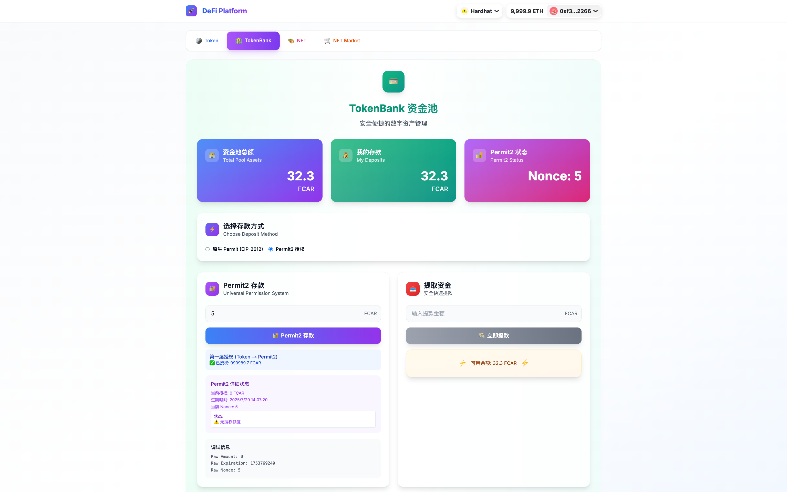

<!--
 * @Author: Mr.Car
 * @Date: 2025-07-26 17:58:16
-->
## TOKENBANK
1. 连接钱包

2. 合约余额

3. 签名存款

4. 提取资金


## NFTMARKET
1. 合约上架


2. 智能购买（白名单 + permit 授权）


## PERMIT2

1. Permit2 购买





## Merkle Tree 白名单 / multicall
测试结果

```Bash
(base) ➜  final_token_bank git:(main) ✗ forge test test/NftMarket.t.sol 
[⠊] Compiling...
No files changed, compilation skipped

Ran 9 tests for test/NftMarket.t.sol:NftMarketTest
[PASS] testBuyNFT() (gas: 126482)
[PASS] testClaimNFT() (gas: 134778)
[PASS] testClaimNFTFailsForNonWhitelistUser() (gas: 59150)
[PASS] testMultiCall() (gas: 37284)
[PASS] testPermitPrePayAndClaimWithMultiCall() (gas: 189362)
[PASS] testPermitPrePayOnly() (gas: 112381)
[PASS] testSetup() (gas: 47922)
[PASS] testUpdateMerkleRoot() (gas: 18550)
[PASS] testUpdateMerkleRootFailsForNonOwner() (gas: 13899)
Suite result: ok. 9 passed; 0 failed; 0 skipped; finished in 12.27ms (23.26ms CPU time)

Ran 1 test suite in 573.10ms (12.27ms CPU time): 9 tests passed, 0 failed, 0 skipped (9 total tests)
(base) ➜  final_token_bank git:(main) ✗ forge test test/NftMarket.t.sol -vvv
[⠊] Compiling...
No files changed, compilation skipped

Ran 9 tests for test/NftMarket.t.sol:NftMarketTest
[PASS] testBuyNFT() (gas: 126482)
Logs:
  NFT contract deployed, checking token count...
  Token deployer (owner): 0x7FA9385bE102ac3EAc297483Dd6233D62b3e1496
  Owner token balance: 100000000000000000000
  Seller NFT ID: 2
  NFT owner: 0x0000000000000000000000000000000000000002

[PASS] testClaimNFT() (gas: 134778)
Logs:
  NFT contract deployed, checking token count...
  Token deployer (owner): 0x7FA9385bE102ac3EAc297483Dd6233D62b3e1496
  Owner token balance: 100000000000000000000
  Seller NFT ID: 2
  NFT owner: 0x0000000000000000000000000000000000000002

[PASS] testClaimNFTFailsForNonWhitelistUser() (gas: 59150)
Logs:
  NFT contract deployed, checking token count...
  Token deployer (owner): 0x7FA9385bE102ac3EAc297483Dd6233D62b3e1496
  Owner token balance: 100000000000000000000
  Seller NFT ID: 2
  NFT owner: 0x0000000000000000000000000000000000000002

[PASS] testMultiCall() (gas: 37284)
Logs:
  NFT contract deployed, checking token count...
  Token deployer (owner): 0x7FA9385bE102ac3EAc297483Dd6233D62b3e1496
  Owner token balance: 100000000000000000000
  Seller NFT ID: 2
  NFT owner: 0x0000000000000000000000000000000000000002

[PASS] testPermitPrePayAndClaimWithMultiCall() (gas: 189362)
Logs:
  NFT contract deployed, checking token count...
  Token deployer (owner): 0x7FA9385bE102ac3EAc297483Dd6233D62b3e1496
  Owner token balance: 100000000000000000000
  Seller NFT ID: 2
  NFT owner: 0x0000000000000000000000000000000000000002

[PASS] testPermitPrePayOnly() (gas: 112381)
Logs:
  NFT contract deployed, checking token count...
  Token deployer (owner): 0x7FA9385bE102ac3EAc297483Dd6233D62b3e1496
  Owner token balance: 100000000000000000000
  Seller NFT ID: 2
  NFT owner: 0x0000000000000000000000000000000000000002

[PASS] testSetup() (gas: 47922)
Logs:
  NFT contract deployed, checking token count...
  Token deployer (owner): 0x7FA9385bE102ac3EAc297483Dd6233D62b3e1496
  Owner token balance: 100000000000000000000
  Seller NFT ID: 2
  NFT owner: 0x0000000000000000000000000000000000000002

[PASS] testUpdateMerkleRoot() (gas: 18550)
Logs:
  NFT contract deployed, checking token count...
  Token deployer (owner): 0x7FA9385bE102ac3EAc297483Dd6233D62b3e1496
  Owner token balance: 100000000000000000000
  Seller NFT ID: 2
  NFT owner: 0x0000000000000000000000000000000000000002

[PASS] testUpdateMerkleRootFailsForNonOwner() (gas: 13899)
Logs:
  NFT contract deployed, checking token count...
  Token deployer (owner): 0x7FA9385bE102ac3EAc297483Dd6233D62b3e1496
  Owner token balance: 100000000000000000000
  Seller NFT ID: 2
  NFT owner: 0x0000000000000000000000000000000000000002

Suite result: ok. 9 passed; 0 failed; 0 skipped; finished in 5.24ms (4.92ms CPU time)

Ran 1 test suite in 623.67ms (5.24ms CPU time): 9 tests passed, 0 failed, 0 skipped (9 total tests)
(base) ➜  final_token_bank git:(main) ✗ 
```